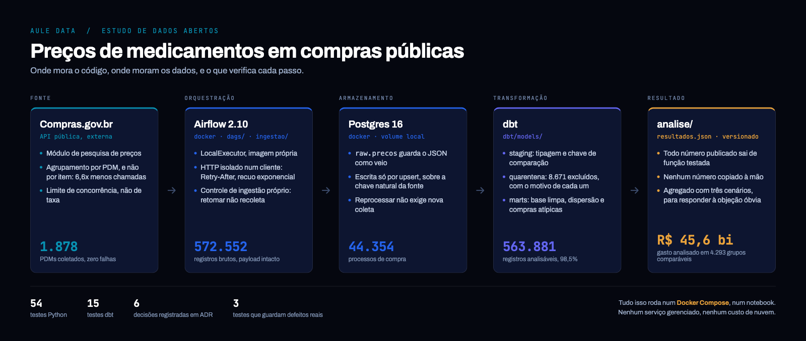
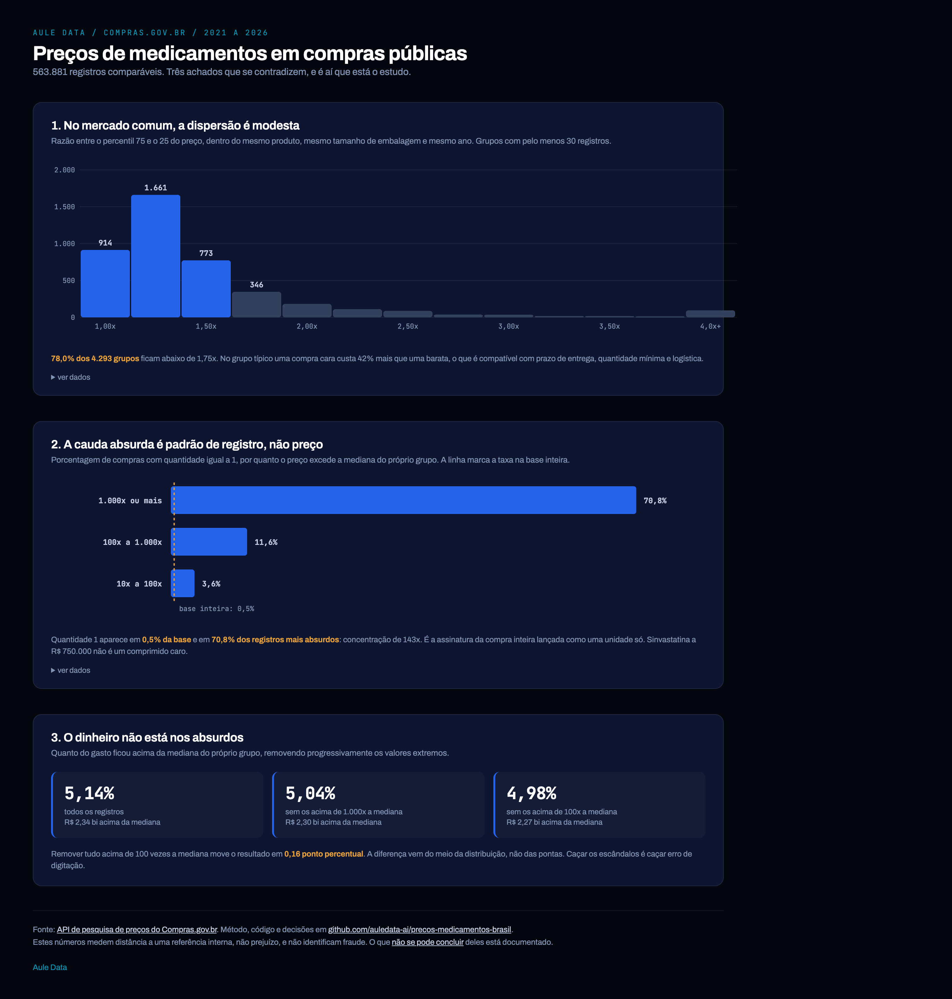

# Preços de medicamentos em compras públicas

O mesmo remédio, comprado por órgãos públicos diferentes, custa quanto?

572 mil registros de compras públicas de medicamentos do Compras.gov.br,
entre 2021 e 2026, coletados e analisados por um pipeline que roda inteiro
num Docker Compose.

**[Ver o painel](https://auledata-ai.github.io/precos-medicamentos-brasil/)**



## O que os dados dizem

**No mercado comum, a dispersão é modesta.** Comparando só o mesmo produto,
mesmo tamanho de embalagem e mesmo ano, no grupo típico uma compra cara
custa 42% mais que uma barata. Isso é compatível com prazo de entrega,
quantidade mínima e logística.

**A cauda absurda é erro de preenchimento, não superfaturamento.**
Sinvastatina a R$ 750.000 aparece na base. Mas 70,8% dos registros acima de
1.000 vezes a mediana têm quantidade igual a 1, contra 0,50% na base
inteira. É a assinatura da compra inteira lançada como uma unidade só.

**O dinheiro não está nos absurdos.** Remover tudo acima de 100 vezes a
mediana muda o agregado em 0,16 ponto percentual. A diferença vem do meio da
distribuição, não das pontas.



Os números completos, e o que eles **não** dizem, estão em
[docs/resultados.md](docs/resultados.md).

## O que este projeto não faz

Não acusa ninguém. A coluna se chama `diferenca_para_a_mediana` porque é
isso que ela mede: distância a uma referência interna. Pagar acima da
mediana tem explicação legítima, e uma compra de urgência para um município
distante deve mesmo custar mais.

A lista de compras atípicas serve para reduzir 564 mil registros a algo que
uma pessoa consegue olhar, com o contexto necessário para julgar cada caso.

## Fonte

[API de pesquisa de preços do Compras.gov.br](https://dadosabertos.compras.gov.br/),
módulo `modulo-pesquisa-preco`. Pública, sem autenticação.

A coleta é agrupada por PDM (Padronização Descritiva de Material) e não por
item de catálogo: são 1.878 chamadas em vez de 12.359, e o resultado é um
superconjunto verificado. O [ADR 0005](docs/decisions/0005-coletar-por-pdm.md)
explica a verificação.

## Como rodar

Precisa de Docker e [uv](https://docs.astral.sh/uv/).

```bash
cp .env.example .env        # troque a senha
docker compose up -d
uv sync
```

O Airflow fica em `localhost:8080`. Dispare a DAG `coleta_precos_medicamentos`.
A coleta completa leva pouco mais de uma hora, sequencial de propósito: o
limite da fonte é de concorrência, não de taxa.

Depois:

A DAG corre o pipeline inteiro: coleta, `dbt build` e a publicação dos
números em `docs/dados/`. Não há passo manual entre a fonte e o painel.

Para correr a transformação sozinha, fora do Airflow:

```bash
export DBT_PROFILES_DIR=$PWD/dbt POSTGRES_HOST=localhost POSTGRES_PORT=5433
cd dbt && uv run dbt build   # 7 modelos, 15 testes
cd .. && uv run python -m analise
```

## Testes

```bash
./scripts/testes.sh          # rápidos + Postgres
./scripts/testes.sh --tudo   # acrescenta o contrato com a API real
```

54 testes Python e 15 testes dbt. Três dos testes dbt guardam defeitos reais
já cometidos neste repositório, e não verificações de rotina.

Um deles merece nota. A primeira definição de "mesmo produto" assumia que a
unidade de fornecimento identificava o item, mas **"FRASCO" não é uma
quantidade**: um único grupo tinha frascos de 50 ML a 2 litros, com volume
misturado com massa. Afetava 32% da base e produzia números plausíveis. O
[ADR 0006](docs/decisions/0006-chave-de-comparacao-de-preco.md) registra o
erro, o tamanho dele e a correção.

## Decisões

As escolhas que mudam o resultado estão em
[docs/decisions](docs/decisions), com o motivo de cada uma.

## Licença

MIT. Veja [LICENSE](LICENSE).

---

Feito pela [Aule Data](https://auledata.com.br), consultoria de dados de
Florianópolis.
